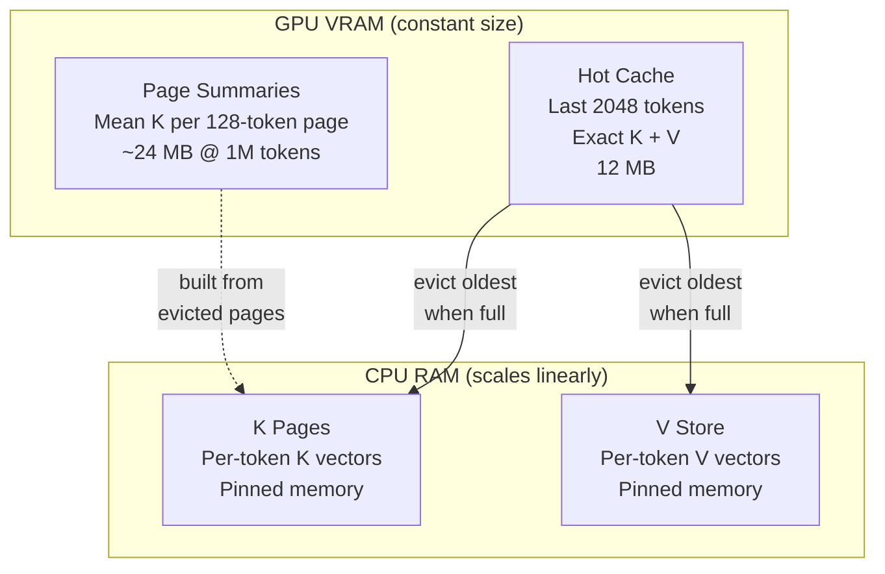
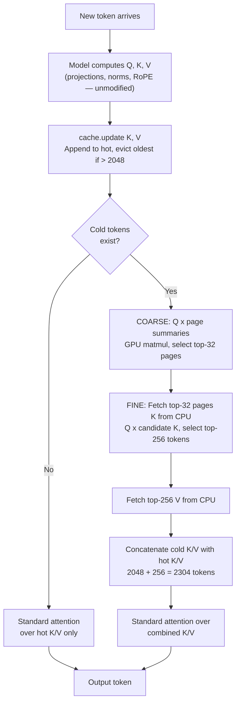

# KIV: K-Indexed V Materialization

Middleware that extends Gemma 4 E2B's context window to 1M+ tokens on a 12GB consumer GPU by replacing the standard KV cache with a tiered retrieval system. No model weights are modified.

## How it works

KIV replaces the standard KV cache for global attention layers with a page-based tiered system. The model's own attention code runs unmodified — KIV operates entirely through the HuggingFace cache interface and a thin attention function wrapper.

### Architecture



1. **Hot cache (VRAM):** Last 2048 tokens with exact K+V for standard attention
2. **Page summaries (VRAM):** Every 128 tokens get a summary vector (mean K). These stay on GPU for fast coarse scoring (~24MB at 1M tokens)
3. **K pages (CPU):** Per-token K vectors on CPU. Only the top-32 pages selected by the coarse pass get transferred to GPU each decode step
4. **V store (CPU):** Per-token V vectors on CPU. Only the top-256 tokens from the fine pass get fetched

The sliding-window layers are untouched — KIV only manages global attention layers.

### Decode step

Each token generation follows this coarse-to-fine retrieval pipeline:



## Performance

> **Note:** All benchmarks were measured on an Intel i7-13700K, 64GB DDR5 (6000MT/s), NVIDIA RTX 4070 (12GB VRAM). Your results will vary with different hardware — CPU-to-GPU transfer speeds and system RAM bandwidth directly affect decode latency and prefill throughput.

| Context | Decode/step | tok/s | VRAM (KIV) | CPU RAM |
|---------|-------------|-------|------------|---------|
| 4K | 77ms | 12.9 | 12MB | 12MB |
| 32K | 110ms | 9.1 | 12MB | 180MB |
| 100K | 122ms | 8.2 | 12MB | 574MB |
| 250K | 142ms | 7.0 | 12MB | 1.4GB |
| 500K | 182ms | 5.5 | 12MB | 2.9GB |
| 1M | 243ms | 4.1 | 12MB | 5.8GB |

VRAM stays at 12MB regardless of context length. Model itself uses ~6.5GB.

Full results in [KIV-RESULTS.md](KIV-RESULTS.md).

## Strengths

- **Constant VRAM:** 12MB hot cache + ~24MB page summaries. Context length has no effect on GPU memory. A 1M token conversation uses the same VRAM as a 4K one.
- **Sub-linear decode scaling:** 77-243ms per token from 4K to 1M — a 3.2x slowdown for 250x more context. The coarse page scoring is a small GPU matmul; the remaining growth comes from CPU-to-GPU V transfers at larger cold stores.
- **No model modification:** Drop-in middleware. Registers a custom cache and attention function, uninstalls cleanly. Model weights and forwards are never touched.
- **Works on consumer hardware:** RTX 4070 (12GB) runs 1M token context. Total GPU usage ~6.5GB.
- **Strong retrieval:** 70/70 needle-in-haystack tests passed. Unique-name phonebook lookup works at P=64 up to 14.5K tokens and at P=256 up to 29K tokens.
- **Chat-friendly:** In a typical multi-turn chat, context grows gradually. Each new message adds a few hundred tokens. KIV handles this with near-zero overhead — most tokens stay in the 2048-token hot cache, and the page index builds incrementally. Decode speed is unaffected by conversation history length.

## Limitations

- **Bulk ingest prefill is slow:** Loading a large document (100K+ tokens) all at once takes significant time because each 4096-token chunk must be processed sequentially. 1M tokens takes ~4.3 minutes for prefill. This is a one-time cost per document — once prefilled, decode is fast. Typical chat conversations don't hit this because context grows incrementally.
- **Bounded prefill loses some information:** When context exceeds the VRAM budget during prefill, early tokens are evicted to cold storage without being re-attended. This is lossless for distinctive facts (needle retrieval: 20/20) but lossy for dense similar-looking data (phonebook: depends on target position). Chat conversations are minimally affected since the most recent turns stay in hot cache.
- **Multi-record aggregation:** Queries like "list all employees named X" need P >= number of matching records. P=256 can't aggregate 41 results from a cold store of 30K tokens.
- **Collision disambiguation:** When multiple records share the same name, the model cannot disambiguate by secondary attributes. The base 4-bit E2B model struggles with this task regardless of attention mechanism.
- **Two-hop reasoning:** The model can't chain lookups (find ID, then use ID to find phone). This is a model reasoning limitation, not a cache limitation.
- **CPU RAM scales linearly:** K and V vectors for all cold tokens live in CPU RAM. At 1M tokens: ~5.8GB. Systems with limited RAM will cap out before GPU does.

## Quick start

```bash
pip install -r requirements.txt

# Smoke test
python scripts/run_eval.py

# Needle retrieval sweep (4K-32K, all depths)
python scripts/needle_grid.py

# Scaling profile (4K-1M, decode + prefill timing)
python scripts/scaling_profile.py

# Adversarial tests (phonebook, collision, multi-needle, two-hop)
python scripts/adversarial.py
```

## Project structure

```
kiv/                    # Core package
  config.py             # KIVConfig (hot_budget, top_p, page_size, top_pages)
  model_topology.py     # Auto-detect model architecture (layers, heads, KV sharing)
  cold_store.py         # Page-based cold storage with coarse-to-fine retrieval
  tiered_cache.py       # TieredKVCache (extends HF DynamicCache)
  middleware.py          # Installs KIV via cache + attention function registration
  eval_utils.py         # Needle-in-haystack test utilities
  eval_harness.py       # Built-in evaluation suite
scripts/                # Benchmarks and test scripts
tests/                  # Unit tests
```

## Configuration

```python
from kiv import KIVConfig, KIVMiddleware

config = KIVConfig(
    hot_budget=2048,    # tokens kept in exact VRAM cache
    top_p=256,          # cold tokens retrieved per decode step
    page_size=128,      # tokens per page in cold store
    top_pages=32,       # pages selected in coarse pass
)
middleware = KIVMiddleware(model, config)
middleware.install()
cache = middleware.create_cache()
```

## Requirements

- Python 3.10+
- PyTorch 2.1+
- Transformers 5.5+
- NVIDIA GPU with 12GB+ VRAM
- 16GB+ system RAM (32GB for 1M context)
- Model: `google/gemma-4-E2B-it`
