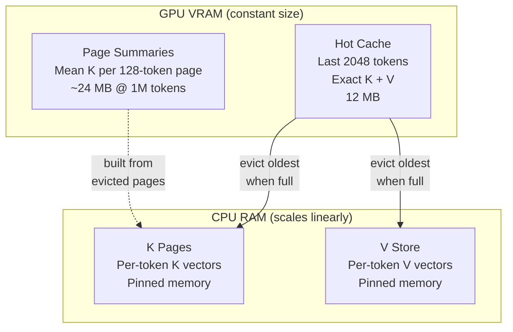
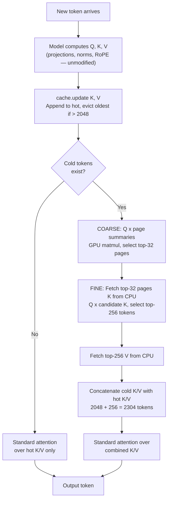

# KIV — 1M token context on a 12GB GPU

Run a local LLM with a conversation history **250× longer** than your GPU should allow. KIV keeps only the last ~2K tokens in VRAM and streams the rest from system RAM on-demand. The GPU cache stays at a flat **12 MB** no matter how long the chat gets.

- 🪟 **1M+ tokens on a single RTX 4070 (12 GB VRAM)** — constant cache footprint
- 🧩 **Any HuggingFace model** — no retraining, no weight changes, clean uninstall
- 🎯 **70/70 needle-in-haystack tests passed**
- 🔌 **Drop-in for ollama clients** — Open WebUI, Continue, Cline, LangChain

Tested on Gemma 4 E2B, Qwen2.5, TinyLlama, and Phi-3.5 (MQA, GQA, MHA architectures).

---

## Contents

1. [How KIV compares](#how-kiv-compares)
2. [Install](#install)
3. [Quick start — Python](#quick-start--python)
4. [Quick start — ollama-compatible server](#quick-start--ollama-compatible-server)
5. [How it works](#how-it-works) *(collapsed)*
6. [Benchmarks](#benchmarks) *(collapsed)*
7. [Server guide — Open WebUI, flags, sessions](#server-guide) *(collapsed)*
8. [Configuration reference](#configuration-reference) *(collapsed)*
9. [Supported models](#supported-models) *(collapsed)*
10. [Limitations](#limitations)
11. [Requirements](#requirements)

---

## How KIV compares

| Approach | Context handling | Trade-off |
|---|---|---|
| Default HuggingFace | Everything in VRAM | OOM at ~8K tokens on 12 GB |
| Quantization (4-bit, GGUF) | Shrinks model, not cache | Context still scales linearly |
| Sliding window | Drops old tokens | Old context gone forever |
| Cloud APIs | Server-side | Data leaves your machine |
| **KIV** | CPU RAM + retrieval | **1M tokens on 12 GB**, slower at long contexts |

---

## Install

```bash
git clone https://github.com/Babyhamsta/KIV.git && cd KIV
pip install -e .
```

For the ollama-compatible server:

```bash
pip install -e ".[hf,server,quantization]"
```

For benchmarks:

```bash
pip install -e ".[all]"
```

---

## Quick start — Python

```python
from transformers import AutoModelForCausalLM, AutoTokenizer, BitsAndBytesConfig
from kiv import KIVConfig, KIVMiddleware

model = AutoModelForCausalLM.from_pretrained(
    "google/gemma-4-E2B-it",
    quantization_config=BitsAndBytesConfig(load_in_4bit=True),
    device_map="auto",
)
tokenizer = AutoTokenizer.from_pretrained("google/gemma-4-E2B-it")

# Install KIV
middleware = KIVMiddleware(model, KIVConfig())
middleware.install()

# Generate
cache = middleware.create_cache()
output = model.generate(input_ids, past_key_values=cache, use_cache=True)

# For long prompts (>4K tokens), use chunked prefill
cache = middleware.create_cache()
logits = middleware.chunked_prefill(input_ids, cache, chunk_size=4096)

# Clean up
middleware.uninstall()
```

<details>
<summary><b>Tuning retrieval quality vs speed</b></summary>

```python
# Higher retrieval quality (more cold tokens fetched per step)
config = KIVConfig(top_p=512, top_pages=64)

# Lower VRAM usage (smaller hot cache)
config = KIVConfig(hot_budget=1024)

# Maximum retrieval (larger hot window + more cold retrieval)
config = KIVConfig(hot_budget=4096, top_p=1024, top_pages=64)
```

See the [full configuration reference](#configuration-reference) for what each parameter does.
</details>

---

## Quick start — ollama-compatible server

Don't want to write Python? KIV ships an HTTP server that speaks the ollama API. Any tool that already talks to ollama (Open WebUI, Continue, Cline, LangChain, raw `curl`) can talk to KIV instead. Point the tool at KIV's port — done.

**What this gives you:** long-context chat inside the same UIs people already use. A 500K-token document pasted into Open WebUI, retrieved against on a 12 GB GPU, same chat bubble you'd use for a 500-token question.

```bash
kiv serve --model google/gemma-4-E2B-it --quantize 4bit
#  -> KIV listening on http://127.0.0.1:11434
```

> [!IMPORTANT]
> **Stop ollama first.** KIV binds port 11434 — the same port ollama uses. If ollama is running, KIV either fails to bind or clients keep hitting the old ollama.
>
> ```bash
> # Windows
> taskkill /F /IM ollama.exe
> # macOS / Linux
> pkill ollama
> ```
>
> Prefer to run both? Move KIV with `--port 11435`.

> [!NOTE]
> **You'll re-download the weights.** KIV loads safetensors from HuggingFace; ollama stores GGUF. One-time cost per model.

See the [Server guide](#server-guide) below for Open WebUI walkthrough, server flags, and session behavior.

---

## How it works

<details>
<summary><b>Click to expand</b> — K/V asymmetry, architecture diagram, decode-step diagram</summary>

KIV replaces the KV cache for global attention layers with a page-based tiered system. The model's own attention code runs unmodified.

### K/V asymmetry

K vectors are smooth and structurally regular — tokens about similar topics produce similar K vectors, so K space is indexable. A page summary (mean K over 128 tokens) retains enough signal to identify relevant pages. V vectors are high-entropy and must be retrieved exactly. KIV indexes K cheaply on GPU via page summaries and fetches V from CPU only for the tokens that score highest.

### Architecture



1. **Hot cache (VRAM):** Last 2048 tokens with exact K+V for standard attention.
2. **Page summaries (VRAM):** Every 128 tokens get a summary vector (mean K). Stays on GPU for fast coarse scoring (~24 MB at 1M tokens).
3. **K pages (CPU):** Per-token K vectors on CPU. Only the top-32 pages selected by the coarse pass get transferred to GPU each decode step.
4. **V store (CPU):** Per-token V vectors on CPU. Only the top-256 tokens from the fine pass get fetched.

Sliding-window layers are untouched.

### Decode step



</details>

---

## Benchmarks

<details>
<summary><b>Click to expand</b> — performance table, strengths, how to run them</summary>

Benchmarks on Intel i7-13700K, 64 GB DDR5 (6000 MT/s), RTX 4070 (12 GB VRAM).

| Context | Decode/step | tok/s | VRAM (KIV) | CPU RAM |
|---|---|---|---|---|
| 4K | 77 ms | 12.9 | 12 MB | 12 MB |
| 32K | 110 ms | 9.1 | 12 MB | 180 MB |
| 100K | 122 ms | 8.2 | 12 MB | 574 MB |
| 250K | 142 ms | 7.0 | 12 MB | 1.4 GB |
| 500K | 182 ms | 5.5 | 12 MB | 2.9 GB |
| 1M | 243 ms | 4.1 | 12 MB | 5.8 GB |

VRAM stays at 12 MB regardless of context length. The model itself uses ~6.5 GB.

Full results in [KIV-RESULTS.md](KIV-RESULTS.md).

### Strengths

- Constant 12 MB VRAM for cache at any context length
- 77–243 ms per token from 4K to 1M (3× slowdown for 250× more context)
- No model modification, no retraining — registers a custom cache and attention function, uninstalls cleanly
- RTX 4070 (12 GB) runs 1M tokens; total GPU usage ~6.5 GB
- 70/70 needle-in-haystack tests passed
- Multi-turn chat adds minimal overhead since context grows gradually

### Run them yourself

```bash
pip install -e ".[all]"

python scripts/run_eval.py            # Smoke test
python scripts/needle_grid.py         # Needle retrieval sweep (4K-32K)
python scripts/scaling_profile.py     # Scaling profile (4K-1M)
python scripts/adversarial.py         # Adversarial tests
python scripts/multi_model_test.py    # Multi-model compatibility
```

</details>

---

## Server guide

<details>
<summary><b>Open WebUI walkthrough</b></summary>

Open WebUI is the most common ollama client.

```bash
# Terminal 1 - KIV
kiv serve --model google/gemma-4-E2B-it --quantize 4bit

# Terminal 2 - Open WebUI
open-webui serve --port 8081
# UI at http://localhost:8081
```

1. Open `http://localhost:8081`, create the admin account.
2. Top-right avatar → **Admin Settings** → **Connections**.
3. Under **Ollama API**: set the base URL to `http://localhost:11434`, toggle ON, save.
4. Refresh. The model dropdown now shows whatever you passed to `--model`.
5. Start chatting.

**Things to know:**

- Open WebUI's **Pull model** button hits `/api/pull`, which KIV does not implement (404 is expected). Models are chosen at `kiv serve` startup, not from the UI.
- Open WebUI polls `/api/ps` and `/api/tags` periodically. KIV answers both.
- Stopping `kiv serve` loses the warm KV cache, but **not** the chat history — Open WebUI stores messages in its own database. The next message after a KIV restart triggers a full re-prefill; after that, append-only reuse resumes.
- Running Open WebUI in Docker? Use `http://host.docker.internal:11434` as the base URL, not `localhost`.

Other clients work the same: Continue, Cline, LangChain's `Ollama` model class, raw `curl` — set the base URL to KIV's port.

> [!WARNING]
> **Streaming JSON parse error in Open WebUI?** Seen as `Unexpected token 'd', "data: {"id"... is not valid JSON`. This is a [known Open WebUI regression](https://github.com/open-webui/open-webui/issues/17501), not a KIV issue — it reproduces against vanilla ollama too. Start Open WebUI with `ENABLE_WEBSOCKET_SUPPORT=false` and hard-reload the browser tab.

</details>

<details>
<summary><b>Controlling the context window (num_ctx)</b></summary>

The context limit the UI advertises comes from KIV's `/api/show` response, which reports the model's native `max_position_embeddings`. To use KIV's full 1M+ window, override `num_ctx` on the client side:

- **Open WebUI:** Chat settings (gear icon) → **Advanced Params** → **Context Length (num_ctx)**. Set to `1048576` for a full 1M window, or any value up to your CPU RAM budget (~5.8 GB at 1M tokens).
- **Continue / Cline:** `num_ctx` lives in the model's config block in `config.json` / `settings.json`.
- **LangChain:** `Ollama(model="...", num_ctx=1048576)`.

KIV itself doesn't cap context — eviction to cold storage is continuous. The `num_ctx` field only matters because clients use it to truncate history before sending. Set it high.

</details>

<details>
<summary><b>Server flags</b></summary>

```bash
kiv serve --model Qwen/Qwen2.5-3B \
  --hot-budget 2048       # recent tokens kept exact in VRAM
  --top-p-kiv 256         # cold tokens retrieved per decode step
  --page-size 128         # tokens per cold page
  --top-pages 32          # pages selected in coarse pass
  --max-slots 4           # number of parallel chat caches
  --prefill-chunk-size 4096
  --prefill-hot-cap 4096
  --host 0.0.0.0 --port 11434
```

Defaults are fine for most users. Only reach for these if you understand the trade-off.

**`--max-slots`** (default `8`) — how many independent chat caches KIV keeps warm at once.

- *Why it exists:* Open WebUI fires extra `/api/chat` calls in the background — title generation, tag generation, follow-up suggestions, RAG query rewrites. Each aux call often inlines the *full* chat, so on a 64K-token conversation each aux can be another 64K-entry cache. With only one cache, every background call would evict your warm main chat.
- *Cost:* almost nothing when empty, bounded by content when populated. A 1M-token chat holds ~5.8 GB of cold store.
- *When to change:* raise to 16 for multiple separate conversations. Lower to 1 for single-conversation mode (re-prefills every aux call).

**`--prefill-chunk-size`** (default `4096`) — tokens per forward pass during bulk prefill.

- *Why it exists:* the attention matrix is `N × N` — a 64K prompt all-at-once needs ~60 GB, a 1M prompt needs far more than any consumer GPU. Chunking bounds each pass.
- *When to change:* drop to 2048 for OOM during large pastes. Raise to 8192 for marginally faster prefill with spare VRAM.

**`--prefill-hot-cap`** (default `4096`) — maximum hot-cache size during bulk prefill.

- *Why it exists:* without a cap, the hot cache grows every chunk and prefill goes quadratic — a 64K prompt that should take 15 s ends up taking 7+ minutes. The cap evicts older tokens to cold between chunks so each chunk's attention stays fixed size. Linear prefill, same setup that passes 70/70 needle tests.
- *Trade-off:* during prefill, tokens beyond the cap are unreachable *within* the same forward. KIV recovers them at decode via cold retrieval.
- *When to change:* raise to 8192 or `0` (disable) if you suspect prefill truncation is hurting quality. Lower to 2048 if very VRAM-constrained. `0` is accurate but quadratic — only for small prompts.

Raise `--top-p-kiv` to 512 or 1024 if retrieval recall on long documents is lower than you'd like.

</details>

<details>
<summary><b>KIV vs ollama — what's different under the hood</b></summary>

KIV implements the ollama HTTP protocol. It does *not* share anything else with ollama:

| | ollama / llama.cpp | KIV |
|---|---|---|
| Model format | GGUF (quantized, llama.cpp-native) | safetensors (PyTorch tensors) |
| Cache location | `~/.ollama/models/` | `~/.cache/huggingface/` |
| KV cache | llama.cpp C++ KV cache | KIV tiered hot/cold (1M+ tokens) |
| Max context on 12 GB | ~32K before OOM | **1M+ tokens, constant VRAM** |

**Why the trade-off exists:** KIV hooks PyTorch attention functions. That hook point is what lets it stream 1M tokens of KV between GPU and CPU on a 4070. llama.cpp's cache is C++ and doesn't expose an equivalent hook. Keeping the safetensors path is what buys you the long context.

</details>

<details>
<summary><b>Session and concurrency model</b></summary>

KIV keeps a small pool of KV caches (default 4 slots) keyed by the token stream each was warmed with. On every request, the server picks the slot whose stored tokens are the longest prefix of the incoming tokens:

- **Append reuse** (new message extends an existing slot) → prefill only the new tail.
- **No match** → allocate a fresh slot (or evict the LRU slot if the pool is full) and prefill the full prompt.

**Why a pool:** Open WebUI and similar clients silently fire auxiliary `/api/chat` calls between user turns — title generation, tag generation, follow-up suggestions, retrieval query rewriting. Each uses a completely different prompt. A single-cache server would evict the user's warm 1M-token main chat every time one of these helpers ran. The pool holds each distinct prefix in its own slot so the main chat stays warm no matter what the UI does in the background.

The server serializes generation requests behind a single lock. It is designed for one-user-per-GPU consumer hardware — the same context where KIV's 1M window is most useful. Concurrent generation is not supported.

</details>

<details>
<summary><b>HTTP endpoints</b></summary>

**Implemented:** `/api/chat`, `/api/generate`, `/api/tags`, `/api/show`, `/api/ps`, `/api/version`. Streaming (NDJSON) and buffered JSON both supported.

**Not implemented** (expected 404): `/api/pull`, `/api/push`, `/api/create`, `/api/copy`, `/api/delete`, `/api/embed`, `/api/blobs/*`. None are required for chat — they're model-management endpoints that don't apply to KIV's "load one model at startup" design.

</details>

---

## Configuration reference

<details>
<summary><b>Click to expand</b> — KIVConfig parameters, manual topology</summary>

KIV has four tunable parameters. Model architecture is auto-detected.

```python
from kiv import KIVConfig, KIVMiddleware

config = KIVConfig(
    hot_budget=2048,    # tokens kept in exact VRAM cache
    top_p=256,          # cold tokens retrieved per decode step
    page_size=128,      # tokens per page in cold store
    top_pages=32,       # pages selected in coarse pass
)
middleware = KIVMiddleware(model, config)
middleware.install()
cache = middleware.create_cache()
```

| Parameter | Default | What it controls |
|---|---|---|
| `hot_budget` | 2048 | Recent tokens kept in VRAM with exact K+V. Higher = more VRAM, larger exact-attention window. |
| `top_p` | 256 | Cold tokens retrieved per decode step. Higher = better recall, more CPU→GPU transfer. |
| `page_size` | 128 | Tokens per page in cold store. Smaller = finer retrieval, more summaries to score. |
| `top_pages` | 32 | Pages selected in coarse pass. Higher = wider candidate pool. |

Defaults work for most cases. Increase `top_p` (512, 1024) for better recall. Increase `hot_budget` if you have VRAM headroom. `page_size` and `top_pages` rarely need changing.

### Manual topology (if auto-detect fails)

```python
from kiv import KIVMiddleware, KIVConfig, ModelTopology

topology = ModelTopology.manual(
    global_layer_indices=tuple(range(32)),
    num_query_heads=32,
    num_kv_heads=8,
    head_dim=128,
    num_hidden_layers=32,
)
middleware = KIVMiddleware(model, KIVConfig(), topology=topology)
```

</details>

---

## Supported models

<details>
<summary><b>Click to expand</b> — tested models + auto-detection coverage</summary>

KIV auto-detects model architecture via `detect_topology()` and works with any HuggingFace model that uses `DynamicCache`.

| Model | Parameters | Attention | KV Heads | Tested | Notes |
|---|---|---|---|---|---|
| Gemma 4 E2B | 2B | Sliding + global | 1 (MQA) | Full suite | Primary development model. KV sharing across layers. |
| Qwen2.5 | 3B | All global | 2 (GQA) | Correctness + needle | Exact logit match, needle retrieval confirmed. |
| TinyLlama | 1.1B | All global | 4 (GQA) | Correctness + generation | Exact logit match. Llama architecture verified. |
| Phi-3.5 mini | 3.8B | All global | 32 (MHA) | Correctness + generation | Exact logit match. Full MHA (no GQA) verified. |
| Llama 3 / 3.2 | 1B–8B | All global | 8 (GQA) | Topology detection | Auto-detection verified. |
| Mistral | 7B | Sliding (uniform) | 8 (GQA) | Topology detection | All layers treated as global by KIV. |
| Gemma 2 / 3 | 2B–27B | Sliding + global | Varies | Topology detection | Architecture auto-detected. |
| Cohere Command R | Varies | Sliding + global | Varies | Topology detection | `layer_types` field detected. |

</details>

---

## Limitations

- **Bulk prefill is slow** — 1M tokens takes ~4.3 min. One-time cost per document.
- **Retrieval accuracy drops on dense repetitive data** (phone books). Distinct facts retrieve reliably.
- **Can't aggregate many scattered results** — `top_p=256` won't find 41 matches across 30K tokens.
- **Can't chain multi-step lookups** (find X, then use X to find Y). Model-reasoning limitation.
- **CPU RAM scales linearly** — ~5.8 GB at 1M tokens.

---

## Requirements

- Python 3.10+
- PyTorch 2.1+
- Transformers 5.5+
- NVIDIA GPU with 12 GB+ VRAM
- 16 GB+ system RAM (32 GB for 1M context)

---

<details>
<summary><b>Project structure</b></summary>

```
kiv/                    # Core package
  config.py             # KIVConfig (hot_budget, top_p, page_size, top_pages)
  model_topology.py     # Auto-detect model architecture (layers, heads, KV sharing)
  cold_store.py         # Page-based cold storage with coarse-to-fine retrieval
  tiered_cache.py       # TieredKVCache (extends HF DynamicCache)
  middleware.py         # Installs KIV via cache + attention function registration
  eval_utils.py         # Needle-in-haystack test utilities
  eval_harness.py       # Built-in evaluation suite
  vllm/                 # vLLM integration (EXPERIMENTAL — not yet tested/validated)
    connector.py        # KV Connector V1 plugin
    attention_hook.py   # Cold retrieval via two-pass attention
    topology.py         # Topology detection from vLLM config
  server/               # Ollama-compatible HTTP server
    app.py              # FastAPI endpoints (/api/chat, /api/generate, /api/tags, ...)
    session.py          # Prefix-reuse session state (KV cache across turns)
    generation.py       # Prefill + token-at-a-time sampling loop
    model_loader.py     # HuggingFace model loading + KIV install
    cli.py              # `kiv serve` entry point
scripts/                # Benchmarks and test scripts
tests/                  # Unit tests
```

</details>
