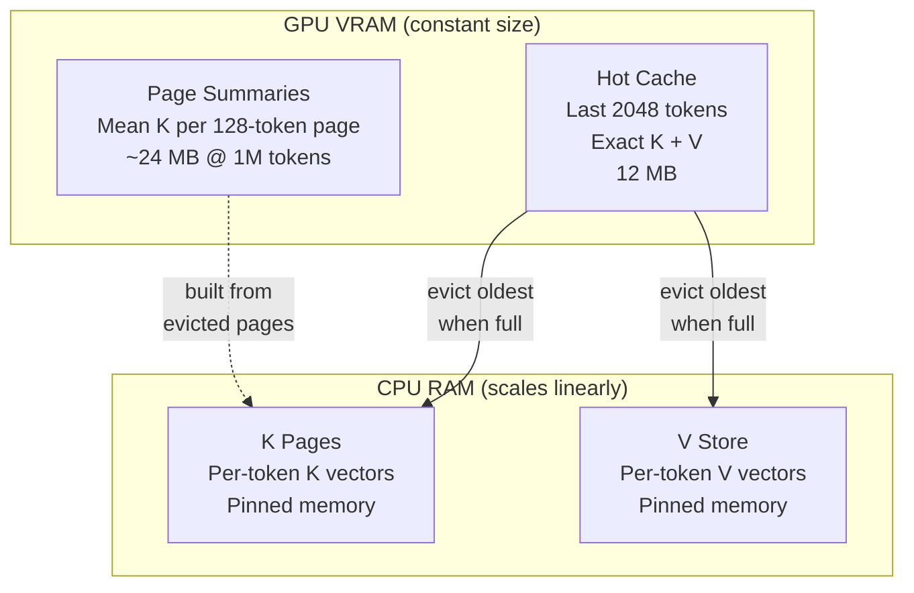
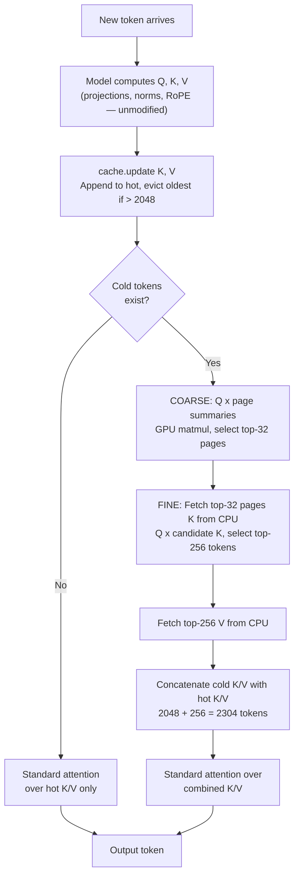

# KIV: Long Context for Local LLMs

When you run a local LLM, the GPU has to hold the entire conversation in memory. The longer the conversation gets, the more VRAM it eats — and on a 12GB card you'll hit "out of memory" after a few thousand tokens. KIV fixes this by moving older parts of the conversation to system RAM and only pulling back the pieces the model actually needs for each token. The GPU memory stays flat no matter how long the conversation gets.

- 1M+ token context on a single RTX 4070 (12GB VRAM), constant 12MB cache footprint
- Works with any HuggingFace model — no retraining, no model changes
- 70/70 needle-in-haystack retrieval tests passed
- Installs and uninstalls cleanly, no model weights modified

Tested on Gemma 4 E2B, Qwen2.5, TinyLlama, and Phi-3.5 across MQA, GQA, and MHA architectures.

## Comparison

| Approach | Context handling | Trade-off |
|----------|-----------------|-----------|
| Default HuggingFace | Everything in VRAM | OOM at ~8K tokens on 12GB GPU |
| Quantization (4-bit, GGUF) | Shrinks model to free VRAM | Context still scales linearly |
| Sliding window | Drops tokens outside window | Old context gone permanently |
| Cloud APIs | Server-side | Data leaves your machine |
| **KIV** | CPU RAM + retrieval | 1M tokens on 12GB GPU, slower at long contexts |

## How it works

KIV replaces the KV cache for global attention layers with a page-based tiered system. The model's own attention code runs unmodified.

### K/V asymmetry

K vectors are smooth and structurally regular — tokens about similar topics produce similar K vectors, so K space is indexable. A page summary (mean K over 128 tokens) retains enough signal to identify relevant pages. V vectors are high-entropy and must be retrieved exactly. KIV indexes K cheaply on GPU via page summaries and fetches V from CPU only for the tokens that score highest.

### Architecture



1. **Hot cache (VRAM):** Last 2048 tokens with exact K+V for standard attention
2. **Page summaries (VRAM):** Every 128 tokens get a summary vector (mean K). These stay on GPU for fast coarse scoring (~24MB at 1M tokens)
3. **K pages (CPU):** Per-token K vectors on CPU. Only the top-32 pages selected by the coarse pass get transferred to GPU each decode step
4. **V store (CPU):** Per-token V vectors on CPU. Only the top-256 tokens from the fine pass get fetched

Sliding-window layers are untouched.

### Decode step



## Performance

Benchmarks on Intel i7-13700K, 64GB DDR5 (6000MT/s), RTX 4070 (12GB VRAM).

| Context | Decode/step | tok/s | VRAM (KIV) | CPU RAM |
|---------|-------------|-------|------------|---------|
| 4K | 77ms | 12.9 | 12MB | 12MB |
| 32K | 110ms | 9.1 | 12MB | 180MB |
| 100K | 122ms | 8.2 | 12MB | 574MB |
| 250K | 142ms | 7.0 | 12MB | 1.4GB |
| 500K | 182ms | 5.5 | 12MB | 2.9GB |
| 1M | 243ms | 4.1 | 12MB | 5.8GB |

VRAM stays at 12MB regardless of context length. Model itself uses ~6.5GB.

Full results in [KIV-RESULTS.md](KIV-RESULTS.md).

## Strengths

- Constant 12MB VRAM for cache at any context length
- 77-243ms per token from 4K to 1M (3x slowdown for 250x more context)
- No model modification, no retraining. Registers a custom cache and attention function, uninstalls cleanly
- RTX 4070 (12GB) runs 1M token context. Total GPU usage ~6.5GB
- 70/70 needle-in-haystack tests passed
- Multi-turn chat adds minimal overhead since context grows gradually

## Limitations

- Bulk prefill is slow: 1M tokens takes ~4.3 minutes. One-time cost per document
- Retrieval accuracy drops on dense repetitive data (phone books). Distinct facts retrieve reliably
- Can't aggregate many scattered results. P=256 won't find 41 matches across 30K tokens
- Can't chain multi-step lookups (find X, then use X to find Y). Model reasoning limitation
- CPU RAM scales linearly: ~5.8GB at 1M tokens

## Quick start

```bash
git clone https://github.com/Babyhamsta/KIV.git && cd KIV
pip install -e .
```

```python
from transformers import AutoModelForCausalLM, AutoTokenizer, BitsAndBytesConfig
from kiv import KIVConfig, KIVMiddleware

# Load any HuggingFace model
model = AutoModelForCausalLM.from_pretrained(
    "google/gemma-4-E2B-it",
    quantization_config=BitsAndBytesConfig(load_in_4bit=True),
    device_map="auto",
)
tokenizer = AutoTokenizer.from_pretrained("google/gemma-4-E2B-it")

# Install KIV with default config
middleware = KIVMiddleware(model, KIVConfig())
middleware.install()

# Generate with KIV cache
cache = middleware.create_cache()
output = model.generate(input_ids, past_key_values=cache, use_cache=True)

# For long prompts (>4K tokens), use chunked prefill
cache = middleware.create_cache()
logits = middleware.chunked_prefill(input_ids, cache, chunk_size=4096)

# Clean up
middleware.uninstall()
```

To tune retrieval quality vs speed, adjust `KIVConfig`:

```python
# Higher retrieval quality (more cold tokens fetched per step)
config = KIVConfig(top_p=512, top_pages=64)

# Lower VRAM usage (smaller hot cache)
config = KIVConfig(hot_budget=1024)

# Maximum retrieval (larger hot window + more cold retrieval)
config = KIVConfig(hot_budget=4096, top_p=1024, top_pages=64)
```

To run the benchmarks:

```bash
pip install -e ".[all]"

python scripts/run_eval.py            # Smoke test
python scripts/needle_grid.py         # Needle retrieval sweep (4K-32K)
python scripts/scaling_profile.py     # Scaling profile (4K-1M)
python scripts/adversarial.py         # Adversarial tests
python scripts/multi_model_test.py    # Multi-model compatibility
```

## Project structure

```
kiv/                    # Core package
  config.py             # KIVConfig (hot_budget, top_p, page_size, top_pages)
  model_topology.py     # Auto-detect model architecture (layers, heads, KV sharing)
  cold_store.py         # Page-based cold storage with coarse-to-fine retrieval
  tiered_cache.py       # TieredKVCache (extends HF DynamicCache)
  middleware.py          # Installs KIV via cache + attention function registration
  eval_utils.py         # Needle-in-haystack test utilities
  eval_harness.py       # Built-in evaluation suite
  vllm/                 # vLLM integration (EXPERIMENTAL — not yet tested/validated)
    connector.py        # KV Connector V1 plugin
    attention_hook.py   # Cold retrieval via two-pass attention
    topology.py         # Topology detection from vLLM config
scripts/                # Benchmarks and test scripts
tests/                  # Unit tests
```

## Configuration

KIV has four tunable parameters. Model architecture is auto-detected.

```python
from kiv import KIVConfig, KIVMiddleware

config = KIVConfig(
    hot_budget=2048,    # tokens kept in exact VRAM cache
    top_p=256,          # cold tokens retrieved per decode step
    page_size=128,      # tokens per page in cold store
    top_pages=32,       # pages selected in coarse pass
)
middleware = KIVMiddleware(model, config)
middleware.install()
cache = middleware.create_cache()
```

| Parameter | Default | What it controls |
|-----------|---------|------------------|
| `hot_budget` | 2048 | Number of recent tokens kept in VRAM with exact K+V. Higher values use more VRAM but give exact attention over a larger window. |
| `top_p` | 256 | Cold tokens retrieved per decode step. Higher values improve retrieval recall at the cost of more CPU-to-GPU transfer and a larger attention window. |
| `page_size` | 128 | Tokens per page in the cold store. Each page gets one summary vector (mean K). Smaller pages give finer-grained retrieval but more summaries to score. |
| `top_pages` | 32 | Pages selected in the coarse scoring pass. Their K vectors are fetched from CPU for fine scoring. Higher values widen the candidate pool. |

Defaults work for most use cases. Increase `top_p` (512, 1024) for better retrieval recall. Increase `hot_budget` if you have VRAM headroom. `page_size` and `top_pages` rarely need changing.

## Supported models

KIV auto-detects model architecture via `detect_topology()` and works with any HuggingFace model that uses `DynamicCache`.

| Model | Parameters | Attention | KV Heads | Tested | Notes |
|-------|-----------|-----------|----------|--------|-------|
| Gemma 4 E2B | 2B | Sliding + global | 1 (MQA) | Full suite | Primary development model. KV sharing across layers. |
| Qwen2.5 | 3B | All global | 2 (GQA) | Correctness + needle | Exact logit match, needle retrieval confirmed. |
| TinyLlama | 1.1B | All global | 4 (GQA) | Correctness + generation | Exact logit match. Llama architecture verified. |
| Phi-3.5 mini | 3.8B | All global | 32 (MHA) | Correctness + generation | Exact logit match. Full MHA (no GQA) verified. |
| Llama 3 / 3.2 | 1B-8B | All global | 8 (GQA) | Topology detection | Auto-detection verified. |
| Mistral | 7B | Sliding (uniform) | 8 (GQA) | Topology detection | All layers treated as global by KIV. |
| Gemma 2 / 3 | 2B-27B | Sliding + global | Varies | Topology detection | Architecture auto-detected. |
| Cohere Command R | Varies | Sliding + global | Varies | Topology detection | `layer_types` field detected. |

If auto-detection fails, pass a manual `ModelTopology`:

```python
from kiv import KIVMiddleware, KIVConfig, ModelTopology

topology = ModelTopology.manual(
    global_layer_indices=tuple(range(32)),  # all layers global
    num_query_heads=32,
    num_kv_heads=8,
    head_dim=128,
    num_hidden_layers=32,
)
middleware = KIVMiddleware(model, KIVConfig(), topology=topology)
```

## Requirements

- Python 3.10+
- PyTorch 2.1+
- Transformers 5.5+
- NVIDIA GPU with 12GB+ VRAM
- 16GB+ system RAM (32GB for 1M context)
