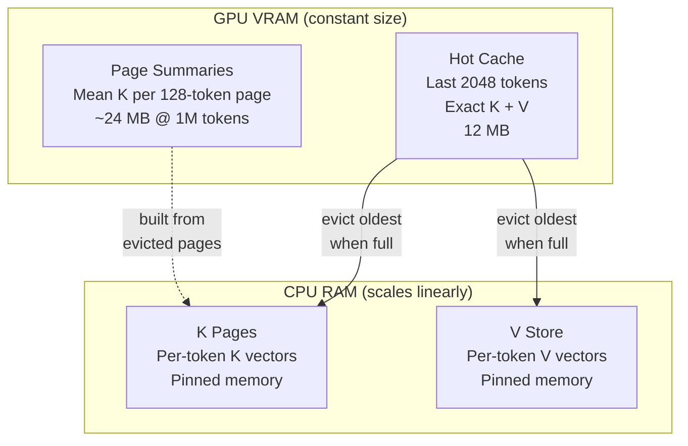
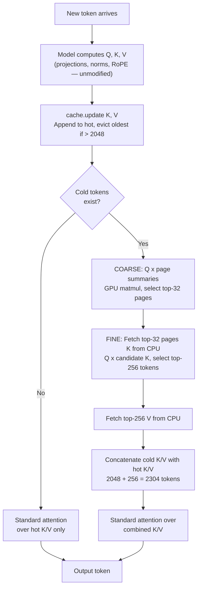

# KIV: Long Context for Local LLMs

When you run a local LLM, the GPU has to hold the entire conversation in memory. The longer the conversation gets, the more VRAM it eats — and on a 12GB card you'll hit "out of memory" after a few thousand tokens. KIV fixes this by moving older parts of the conversation to system RAM and only pulling back the pieces the model actually needs for each token. The GPU memory stays flat no matter how long the conversation gets.

- 1M+ token context on a single RTX 4070 (12GB VRAM), constant 12MB cache footprint
- Works with any HuggingFace model — no retraining, no model changes
- 70/70 needle-in-haystack retrieval tests passed
- Installs and uninstalls cleanly, no model weights modified

Tested on Gemma 4 E2B, Qwen2.5, TinyLlama, and Phi-3.5 across MQA, GQA, and MHA architectures.

## Comparison

| Approach | Context handling | Trade-off |
|----------|-----------------|-----------|
| Default HuggingFace | Everything in VRAM | OOM at ~8K tokens on 12GB GPU |
| Quantization (4-bit, GGUF) | Shrinks model to free VRAM | Context still scales linearly |
| Sliding window | Drops tokens outside window | Old context gone permanently |
| Cloud APIs | Server-side | Data leaves your machine |
| **KIV** | CPU RAM + retrieval | 1M tokens on 12GB GPU, slower at long contexts |

## How it works

KIV replaces the KV cache for global attention layers with a page-based tiered system. The model's own attention code runs unmodified.

### K/V asymmetry

K vectors are smooth and structurally regular — tokens about similar topics produce similar K vectors, so K space is indexable. A page summary (mean K over 128 tokens) retains enough signal to identify relevant pages. V vectors are high-entropy and must be retrieved exactly. KIV indexes K cheaply on GPU via page summaries and fetches V from CPU only for the tokens that score highest.

### Architecture



1. **Hot cache (VRAM):** Last 2048 tokens with exact K+V for standard attention
2. **Page summaries (VRAM):** Every 128 tokens get a summary vector (mean K). These stay on GPU for fast coarse scoring (~24MB at 1M tokens)
3. **K pages (CPU):** Per-token K vectors on CPU. Only the top-32 pages selected by the coarse pass get transferred to GPU each decode step
4. **V store (CPU):** Per-token V vectors on CPU. Only the top-256 tokens from the fine pass get fetched

Sliding-window layers are untouched.

### Decode step



## Performance

Benchmarks on Intel i7-13700K, 64GB DDR5 (6000MT/s), RTX 4070 (12GB VRAM).

| Context | Decode/step | tok/s | VRAM (KIV) | CPU RAM |
|---------|-------------|-------|------------|---------|
| 4K | 77ms | 12.9 | 12MB | 12MB |
| 32K | 110ms | 9.1 | 12MB | 180MB |
| 100K | 122ms | 8.2 | 12MB | 574MB |
| 250K | 142ms | 7.0 | 12MB | 1.4GB |
| 500K | 182ms | 5.5 | 12MB | 2.9GB |
| 1M | 243ms | 4.1 | 12MB | 5.8GB |

VRAM stays at 12MB regardless of context length. Model itself uses ~6.5GB.

Full results in [KIV-RESULTS.md](KIV-RESULTS.md).

## Strengths

- Constant 12MB VRAM for cache at any context length
- 77-243ms per token from 4K to 1M (3x slowdown for 250x more context)
- No model modification, no retraining. Registers a custom cache and attention function, uninstalls cleanly
- RTX 4070 (12GB) runs 1M token context. Total GPU usage ~6.5GB
- 70/70 needle-in-haystack tests passed
- Multi-turn chat adds minimal overhead since context grows gradually

## Limitations

- Bulk prefill is slow: 1M tokens takes ~4.3 minutes. One-time cost per document
- Retrieval accuracy drops on dense repetitive data (phone books). Distinct facts retrieve reliably
- Can't aggregate many scattered results. P=256 won't find 41 matches across 30K tokens
- Can't chain multi-step lookups (find X, then use X to find Y). Model reasoning limitation
- CPU RAM scales linearly: ~5.8GB at 1M tokens

## Quick start

```bash
git clone https://github.com/Babyhamsta/KIV.git && cd KIV
pip install -e .
```

```python
from transformers import AutoModelForCausalLM, AutoTokenizer, BitsAndBytesConfig
from kiv import KIVConfig, KIVMiddleware

# Load any HuggingFace model
model = AutoModelForCausalLM.from_pretrained(
    "google/gemma-4-E2B-it",
    quantization_config=BitsAndBytesConfig(load_in_4bit=True),
    device_map="auto",
)
tokenizer = AutoTokenizer.from_pretrained("google/gemma-4-E2B-it")

# Install KIV with default config
middleware = KIVMiddleware(model, KIVConfig())
middleware.install()

# Generate with KIV cache
cache = middleware.create_cache()
output = model.generate(input_ids, past_key_values=cache, use_cache=True)

# For long prompts (>4K tokens), use chunked prefill
cache = middleware.create_cache()
logits = middleware.chunked_prefill(input_ids, cache, chunk_size=4096)

# Clean up
middleware.uninstall()
```

To tune retrieval quality vs speed, adjust `KIVConfig`:

```python
# Higher retrieval quality (more cold tokens fetched per step)
config = KIVConfig(top_p=512, top_pages=64)

# Lower VRAM usage (smaller hot cache)
config = KIVConfig(hot_budget=1024)

# Maximum retrieval (larger hot window + more cold retrieval)
config = KIVConfig(hot_budget=4096, top_p=1024, top_pages=64)
```

## Use with ollama clients (Open WebUI, Continue, Cline, LangChain)

Most people don't want to write Python to use a model — they want to plug it into an existing chat UI or coding assistant. KIV ships an HTTP server that speaks the ollama API, so any tool that already talks to ollama can talk to KIV instead. Point the tool at KIV's port, and it works. No tool-side changes.

**What this gives you:** long-context chat inside the same UIs people already use. A 500K-token document pasted into Open WebUI, retrieved against on a 12GB GPU, with the same chat bubble you'd use for a 500-token question.

### Install and launch

```bash
pip install -e ".[hf,server,quantization]"

kiv serve --model google/gemma-4-E2B-it --quantize 4bit
#  -> KIV listening on http://127.0.0.1:11434
```

KIV binds to port 11434 by default — the same port ollama uses. This is intentional: any client already configured for ollama sees KIV as if it were ollama. No reconfiguration beyond the base URL.

### You must stop ollama before starting KIV

Port 11434 is held by one process at a time, and on Windows the ollama installer registers a background service that auto-starts on login. If that service is running, KIV either fails to bind or appears to start but clients continue hitting the old ollama.

Before running `kiv serve`:

```bash
# Windows
taskkill /F /IM ollama.exe
# or right-click the ollama tray icon -> Quit

# macOS / Linux
pkill ollama
# or systemctl --user stop ollama
```

Verify port 11434 is free: `netstat -ano | findstr :11434` (Windows) or `lsof -i :11434` (macOS/Linux) — should be empty.

Prefer to keep ollama running side-by-side? Move KIV to a different port with `--port 11435` and point your client there.

### KIV replaces ollama's API, not its model store

KIV implements the ollama HTTP protocol. It does *not* share anything else with ollama:

| | ollama / llama.cpp | KIV |
|---|---|---|
| Model format | GGUF (quantized, llama.cpp-native) | safetensors (PyTorch tensors) |
| Cache location | `~/.ollama/models/` | `~/.cache/huggingface/` |
| KV cache | llama.cpp C++ KV cache | KIV tiered hot/cold (1M+ tokens) |
| Max context on 12GB | ~32K before OOM | **1M+ tokens, constant VRAM** |

**You will re-download the weights.** If you already have `ollama pull llama3` on disk, KIV won't reuse it — they're different file formats. `kiv serve --model meta-llama/Llama-3-8B` pulls the safetensors version from HuggingFace. One-time cost per model. The KIV-supported models table below is what actually matters; ollama model tags do not map to anything on the KIV side.

Why this trade-off exists: KIV hooks PyTorch attention functions. That hook point is what lets it stream 1M tokens of KV between GPU and CPU on a 4070. llama.cpp's cache is C++ and doesn't expose an equivalent hook. Keeping the safetensors path is what buys you the long context.

### Open WebUI walkthrough

Open WebUI is the most common ollama client. Setup:

```bash
# Terminal 1 - KIV
kiv serve --model google/gemma-4-E2B-it --quantize 4bit

# Terminal 2 - Open WebUI
open-webui serve --port 8081
# UI at http://localhost:8081
```

In the Open WebUI UI:

1. Open `http://localhost:8081`, create the admin account.
2. Top-right avatar → **Admin Settings** → **Connections**.
3. Under **Ollama API**: set the base URL to `http://localhost:11434`, toggle ON, save.
4. Refresh. The model dropdown now shows whatever you passed to `--model`.
5. Start chatting.

**Things to know:**

- Open WebUI's "Pull model" button hits `/api/pull`, which KIV does not implement (404 is expected). Models are chosen at `kiv serve` startup, not from the UI.
- Open WebUI will poll `/api/ps` and `/api/tags` periodically. KIV answers both.
- Stopping `kiv serve` loses the warm KV cache, but **not** the chat history — Open WebUI stores messages in its own database. Your next message after a KIV restart triggers a full re-prefill of the conversation; after that, append-only reuse resumes.
- Running Open WebUI in Docker? Use `http://host.docker.internal:11434` as the base URL, not `localhost`.

Other clients work the same way: Continue, Cline, LangChain's `Ollama` model class, raw `curl` — set the base URL to KIV's port.

#### If Open WebUI shows a streaming JSON parse error

Seen as `Unexpected token 'd', "data: {"id"... is not valid JSON`. This is a [known Open WebUI regression](https://github.com/open-webui/open-webui/issues/17501), not a KIV issue — it reproduces against vanilla ollama too. Start Open WebUI with `ENABLE_WEBSOCKET_SUPPORT=false` and hard-reload the browser tab. Upstream tracks the fix.

### Controlling the context window

The context limit the UI advertises comes from KIV's `/api/show` response, which reports the model's native `max_position_embeddings`. To use KIV's full 1M+ window, override `num_ctx` on the client side:

- **Open WebUI:** Chat settings (gear icon in the chat) → **Advanced Params** → **Context Length (num_ctx)**. Set to 1048576 for a full 1M window, or any value up to your CPU RAM budget (~5.8GB at 1M tokens).
- **Continue / Cline:** `num_ctx` lives in the model's config block in `config.json` / `settings.json`.
- **LangChain:** `Ollama(model="...", num_ctx=1048576)`.

KIV itself doesn't cap context — eviction to cold storage is continuous. The `num_ctx` field matters only because clients use it to truncate conversation history before sending. Set it high.

You can also tune KIV's retrieval behavior at server start:

```bash
kiv serve --model Qwen/Qwen2.5-3B \
  --hot-budget 2048       # recent tokens kept exact in VRAM
  --top-p-kiv 256         # cold tokens retrieved per decode step (higher = better recall, more transfer)
  --page-size 128         # tokens per cold page
  --top-pages 32          # pages selected in coarse pass
  --max-slots 4           # number of parallel chat caches (see below)
  --prefill-chunk-size 4096
  --prefill-hot-cap 4096
  --host 0.0.0.0 --port 11434
```

### Server-specific flags

These control how the HTTP server schedules work around KIV's core. Defaults are fine for most users — only reach for them if you understand the trade-off.

**`--max-slots`** (default `8`). How many independent chat caches KIV keeps warm at once.

- **Why it exists:** Open WebUI and similar clients silently fire extra `/api/chat` calls in the background — to generate conversation titles, tags, follow-up suggestion buttons, or RAG query rewrites. Each aux call often inlines the *full* chat content (so the helper model has context), so on a 64K-token conversation each aux can be another 64K-entry cache slot. With only one cache, every background call would evict your warm main chat. With a pool of 4, Open WebUI's typical 3-4 aux calls per message can still fill it and LRU-evict the main chat. 8 is the sweet spot for a single active conversation under Open WebUI's aux-call pattern.
- **What a slot costs:** almost nothing when empty, bounded by the content it holds when populated. A slot inlined with a 1M-token chat holds ~5.8GB of CPU RAM worth of cold store.
- **When to change:** raise to 16 if you run multiple separate conversations in the same UI and want to switch between them without re-prefill. Lower to 1 to force single-conversation mode (will re-prefill every aux call).

**`--prefill-chunk-size`** (default `4096`). Tokens processed per forward pass during bulk prefill.

- **Why it exists:** the model attends over everything as you feed it your document. Do it all at once and the attention matrix is `N × N` — a 64K prompt needs ~60GB, a 1M prompt needs way more than any consumer GPU has. Chunking splits the forward so each pass is bounded.
- **What changes with it:** smaller chunks use less peak VRAM but have more per-chunk overhead. Larger chunks are faster but risk OOM on long prompts.
- **When to change:** drop to 2048 if you see out-of-memory errors during large pastes. Raise to 8192 if you have VRAM to spare and want marginally faster prefill.

**`--prefill-hot-cap`** (default `4096`). Maximum hot-cache size during bulk prefill.

- **Why it exists:** without a cap, the hot cache grows every chunk. Attention in the last chunk has to compute against the entire prompt so far — prefill becomes quadratic. A 64K prompt that should take 15 seconds ends up taking 7+ minutes. With the cap, after each chunk the older tokens get evicted to cold and the next chunk's attention stays a fixed size. Prefill goes from quadratic back to linear. This is the same bound the scaling-profile benchmark uses to reach 1M tokens in ~4.3 minutes.
- **The trade-off:** during prefill, tokens beyond the cap are unreachable. Later tokens can't attend to very early tokens inside the same forward. KIV recovers this at decode time via cold retrieval — this is exactly the setup that passes 70/70 needle-in-haystack tests, so it's the proven path, not a shortcut.
- **When to change:** raise to 8192 or `--prefill-hot-cap 0` (disable entirely) if you suspect the prefill truncation is hurting quality on your specific prompt. Lower to 2048 if you're very VRAM-constrained. Pass `0` to fall back to unbounded prefill, which is accurate but quadratic — only usable on small prompts.

Defaults work for most cases. Raise `--top-p-kiv` to 512 or 1024 if retrieval recall on long documents is lower than you'd like. See the Configuration section for how each parameter trades off.

### Session and concurrency model

KIV keeps a small pool of KV caches (default 4 slots) keyed by the token stream each was warmed with. On every request, the server picks the slot whose stored tokens are the longest prefix of the incoming tokens:

- **Append reuse** (new message extends an existing slot) → prefill only the new tail on that slot.
- **No match** → allocate a fresh slot (or evict the LRU slot if the pool is full) and prefill the full prompt.

Why a pool instead of a single slot: Open WebUI and other common clients silently fire auxiliary `/api/chat` calls between user turns — title generation, tag generation, follow-up suggestion generation, retrieval query rewriting. Each uses a completely different prompt from the main conversation. A single-cache server would evict the user's warm 1M-token main chat every time one of these helpers ran. The pool holds each distinct prefix in its own slot so the main chat stays warm no matter what the UI does in the background.

Tune pool size with `--max-slots` (default 4). Each extra slot only costs what its prefix actually holds; aux-call slots stay tiny since title-gen prompts are short.

The server serializes generation requests behind a single lock. It is designed for one-user-per-GPU consumer hardware — the same context where KIV's 1M window is most useful. Concurrent generation is not supported.

### Endpoints implemented

`/api/chat`, `/api/generate`, `/api/tags`, `/api/show`, `/api/ps`, `/api/version`. Streaming (NDJSON) and buffered JSON both supported.

Not implemented (expected 404): `/api/pull`, `/api/push`, `/api/create`, `/api/copy`, `/api/delete`, `/api/embed`, `/api/blobs/*`. None are required for chat; they are model-management endpoints that don't apply to KIV's "load one model at startup" design.

## Run the benchmarks

```bash
pip install -e ".[all]"

python scripts/run_eval.py            # Smoke test
python scripts/needle_grid.py         # Needle retrieval sweep (4K-32K)
python scripts/scaling_profile.py     # Scaling profile (4K-1M)
python scripts/adversarial.py         # Adversarial tests
python scripts/multi_model_test.py    # Multi-model compatibility
```

## Project structure

```
kiv/                    # Core package
  config.py             # KIVConfig (hot_budget, top_p, page_size, top_pages)
  model_topology.py     # Auto-detect model architecture (layers, heads, KV sharing)
  cold_store.py         # Page-based cold storage with coarse-to-fine retrieval
  tiered_cache.py       # TieredKVCache (extends HF DynamicCache)
  middleware.py          # Installs KIV via cache + attention function registration
  eval_utils.py         # Needle-in-haystack test utilities
  eval_harness.py       # Built-in evaluation suite
  vllm/                 # vLLM integration (EXPERIMENTAL — not yet tested/validated)
    connector.py        # KV Connector V1 plugin
    attention_hook.py   # Cold retrieval via two-pass attention
    topology.py         # Topology detection from vLLM config
  server/               # Ollama-compatible HTTP server
    app.py              # FastAPI endpoints (/api/chat, /api/generate, /api/tags, ...)
    session.py          # Prefix-reuse session state (KV cache across turns)
    generation.py       # Prefill + token-at-a-time sampling loop
    model_loader.py     # HuggingFace model loading + KIV install
    cli.py              # `kiv serve` entry point
scripts/                # Benchmarks and test scripts
tests/                  # Unit tests
```

## Configuration

KIV has four tunable parameters. Model architecture is auto-detected.

```python
from kiv import KIVConfig, KIVMiddleware

config = KIVConfig(
    hot_budget=2048,    # tokens kept in exact VRAM cache
    top_p=256,          # cold tokens retrieved per decode step
    page_size=128,      # tokens per page in cold store
    top_pages=32,       # pages selected in coarse pass
)
middleware = KIVMiddleware(model, config)
middleware.install()
cache = middleware.create_cache()
```

| Parameter | Default | What it controls |
|-----------|---------|------------------|
| `hot_budget` | 2048 | Number of recent tokens kept in VRAM with exact K+V. Higher values use more VRAM but give exact attention over a larger window. |
| `top_p` | 256 | Cold tokens retrieved per decode step. Higher values improve retrieval recall at the cost of more CPU-to-GPU transfer and a larger attention window. |
| `page_size` | 128 | Tokens per page in the cold store. Each page gets one summary vector (mean K). Smaller pages give finer-grained retrieval but more summaries to score. |
| `top_pages` | 32 | Pages selected in the coarse scoring pass. Their K vectors are fetched from CPU for fine scoring. Higher values widen the candidate pool. |

Defaults work for most use cases. Increase `top_p` (512, 1024) for better retrieval recall. Increase `hot_budget` if you have VRAM headroom. `page_size` and `top_pages` rarely need changing.

## Supported models

KIV auto-detects model architecture via `detect_topology()` and works with any HuggingFace model that uses `DynamicCache`.

| Model | Parameters | Attention | KV Heads | Tested | Notes |
|-------|-----------|-----------|----------|--------|-------|
| Gemma 4 E2B | 2B | Sliding + global | 1 (MQA) | Full suite | Primary development model. KV sharing across layers. |
| Qwen2.5 | 3B | All global | 2 (GQA) | Correctness + needle | Exact logit match, needle retrieval confirmed. |
| TinyLlama | 1.1B | All global | 4 (GQA) | Correctness + generation | Exact logit match. Llama architecture verified. |
| Phi-3.5 mini | 3.8B | All global | 32 (MHA) | Correctness + generation | Exact logit match. Full MHA (no GQA) verified. |
| Llama 3 / 3.2 | 1B-8B | All global | 8 (GQA) | Topology detection | Auto-detection verified. |
| Mistral | 7B | Sliding (uniform) | 8 (GQA) | Topology detection | All layers treated as global by KIV. |
| Gemma 2 / 3 | 2B-27B | Sliding + global | Varies | Topology detection | Architecture auto-detected. |
| Cohere Command R | Varies | Sliding + global | Varies | Topology detection | `layer_types` field detected. |

If auto-detection fails, pass a manual `ModelTopology`:

```python
from kiv import KIVMiddleware, KIVConfig, ModelTopology

topology = ModelTopology.manual(
    global_layer_indices=tuple(range(32)),  # all layers global
    num_query_heads=32,
    num_kv_heads=8,
    head_dim=128,
    num_hidden_layers=32,
)
middleware = KIVMiddleware(model, KIVConfig(), topology=topology)
```

## Requirements

- Python 3.10+
- PyTorch 2.1+
- Transformers 5.5+
- NVIDIA GPU with 12GB+ VRAM
- 16GB+ system RAM (32GB for 1M context)
